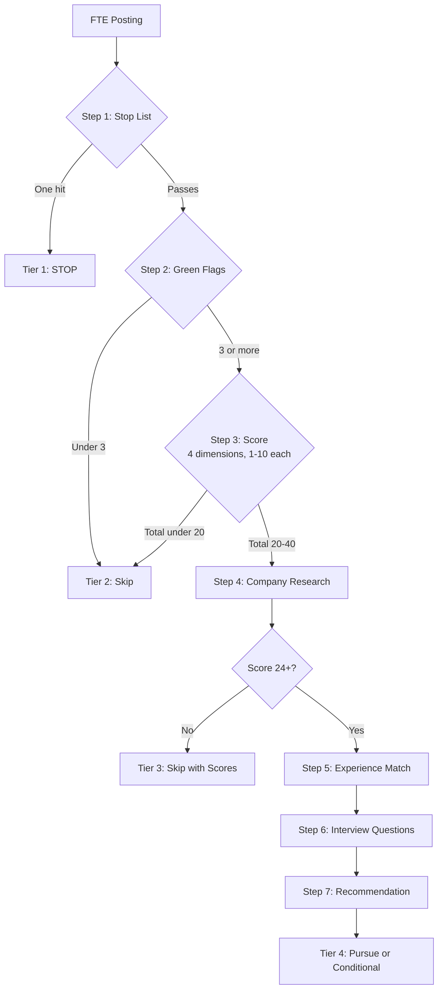
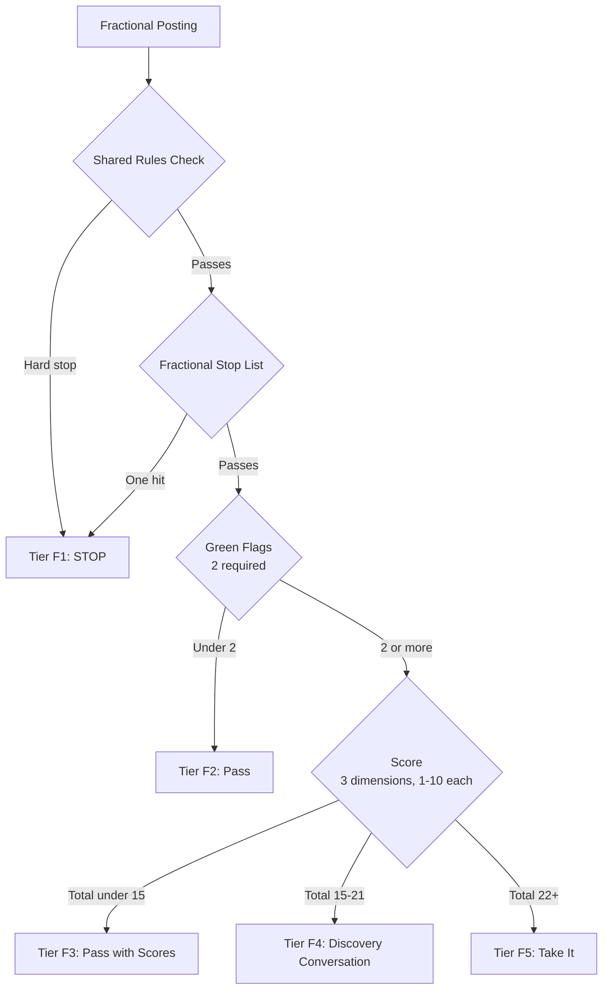

# jd-triage

A Claude skill that triages job descriptions and contract postings across two evaluation tracks, scores them, and recommends pursue, conditional, or skip for full-time roles and take it, discovery conversation, or pass for fractional engagements. Built for senior product managers but adaptable to any role and discipline.

The clinical metaphor is deliberate. Stop list maps to contraindications. Green flags map to positive indications. Scoring is the differential. The recommendation is the disposition. Phased file loading is escalating workup only when warranted.

## TL;DR

- Two tracks: FTE (full-time employment) and Fractional (1099, corp-to-corp)
- Inputs: a posting (text, URL, or file) plus a track declaration
- FTE output: scored evaluation with company research, experience match, and tailored interview questions
- Fractional output: scored evaluation with scoping questions and engagement recommendation
- Criteria: loaded at runtime from a versioned external reference file, not hardcoded in the skill
- Storage: writes to Notion and Excel for trend analysis over time
- FTE platforms searched: Indeed, Dice, ZipRecruiter, Hiring Cafe, Wellfound
- Fractional platforms searched: Dice, Indeed, ZipRecruiter, Toptal, Upwork
- Instrumentation: rubric is versioned, outcomes are tracked, system is falsifiable
- Status: working tool, used in active job search and fractional pipeline
- Tuning: opinionated to one user. Fork and adapt.

## The problem

The job search process for a senior PM in 2026 looks like this:

- Read postings written by HR who do not know what a PM does
- Apply to "Senior PM" roles. Realize on the first call they are implementation.
- Spend an hour researching a company that ghosts you
- Forget what you decided about the role you saw last Tuesday

The fractional search problem is different but adjacent:

- Contract postings rarely say whether they are 1099 or W2 until you ask
- "Fractional PM" postings range from real scoped engagements to staff augmentation with a different label
- No structured way to filter for hours fit, deliverable clarity, and interest before spending time on a call

This tool fixes both. It triages postings against a framework built around what matters for each track and learns from your pipeline over time.

## What it does

Two tracks, two search modes, one pipeline.

**Single posting triage.** Paste a posting, declare a track (or let the skill detect it), get back a scored recommendation with the appropriate output for that track.

**FTE job search.** Search Indeed, Dice, ZipRecruiter, Hiring Cafe, and Wellfound for matching roles, filter, and evaluate the top candidates.

**Fractional search.** Search Dice, Indeed, ZipRecruiter, Toptal, and Upwork for contract and fractional postings, filter, and evaluate against deliverable, hours, and interest dimensions.

Both flows save results to Notion and Excel with a Track field so FTE and fractional pipeline stay in the same database but remain filterable.

## How the triage works

### FTE track



The four FTE scoring dimensions are Ownership, Process, Leadership, and Work. Each scored 1 to 10. Total is x/40. Threshold for full evaluation is 24. Threshold for Pursue is 30.

### Fractional track



The three fractional scoring dimensions are Deliverable, Hours, and Interest. Each scored 1 to 10. Total is x/30. No company research. No experience match. Scoping questions instead of interview questions.

## Criteria live in an external file, not the skill

All stop lists, green flag lists, scoring rubrics, and compensation targets are stored in a versioned reference file (`jd-reference-v[n].md`), not hardcoded in the skill. The skill loads the highest-versioned file at runtime.

This means:
- Changing criteria does not require editing the skill file
- Every evaluation is attributable to the reference file version that scored it
- Forking and adapting the criteria is a file edit, not a skill edit

The reference file has three sections: Shared Rules (apply to both tracks), FTE track criteria, and Fractional track criteria.

See the included `jd-reference-v2.md` for a working example. Replace the criteria with your own.

## What gets tracked

Every evaluation saves to Notion and Excel with:

- Track (FTE or Fractional)
- Scores and recommendation
- Company research (FTE only): stage, leadership, AI signal, stability flags
- Experience match (FTE only)
- Tailored interview questions (FTE) or scoping questions (Fractional)
- The rubric version that scored it
- The application or engagement outcome lifecycle

FTE statuses: Not applied → Applied → Phone screen → Interview → Offer → terminal state

Fractional statuses: Not contacted → Discovery call scheduled → Discovery call complete → Proposal sent → Engaged → Engagement complete → terminal state

After a search run, a results summary table is the default output — one row per scored result, ordered by score. Full reports render on demand with "show [company]". Nothing re-runs. Detail was already computed internally.

The rubric is versioned. Every evaluation stays attributable to the criteria that scored it.

See [DECISIONS.md](DECISIONS.md) for the design rationale.

## Setup

Requires:

- Claude with skills feature enabled
- Notion connector with a pipeline database
- Excel access for local backup

Steps:

1. Copy `SKILL.md` into your Claude app's skill editor.
2. Create your `jd-reference-v1.md` using the included example as a starting point. Replace all criteria with your own.
3. Create your `profile.md`, `style-guide.md`, `resume-v1.pdf`, and `cv-v1.md`.
4. Update file path references in the skill to match your local setup.
5. Set up the Notion database. Property schema is documented in `SKILL.md`.
6. Drop `job-search-pipeline.xlsx` into your outputs folder.
7. Update `RUBRIC_VERSION` at the top of the skill to today's date.

## Use

In Claude chat:

```
triage fte [paste JD text or URL]
```

```
triage fractional [paste posting text or URL]
```

After the evaluation, save it:

```
save [company name]
```

Track outcomes as they happen:

```
outcome [company] applied
update [company] phone screen
outcome [company] rejected
```

Run a multi-platform FTE search:

```
search jobs
```

Run a fractional search:

```
search fractional
```

## Status

This is a personal tool used daily in an active job search and fractional pipeline. It is opinionated to one user's profile (senior PM, health tech, clinical AI, remote, no direct reports, fractional 1099 only). The criteria, voice rules, and scoring rubric reflect one person's preferences.

If you want to use it, fork it and tune the criteria to yourself. The architecture is general. The opinions are not.

A general-purpose version with a separated engine and profile-building onboarding is on the roadmap. See [DECISIONS.md](DECISIONS.md) for the rationale.

## What's in the repo

- `SKILL.md` — the skill itself, ready to paste into the Claude app
- `jd-reference-v2.md` — example criteria file for both tracks
- `DECISIONS.md` — why the skill is built the way it is
- `job-search-pipeline.xlsx` — Excel template for the pipeline
- `README.md` — this file
- `LICENSE` — MIT

## License

MIT. Build on this.

## Author

Jessica Parker, BSN, RN. Senior Product Manager. Clinical, technical, and product across 16 years.
