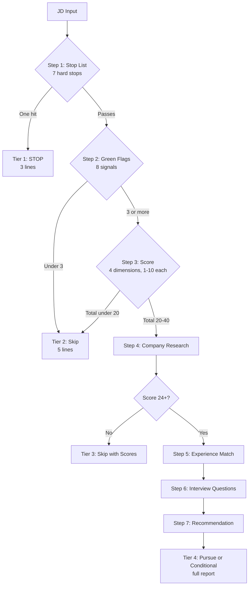

# jd-triage

A Claude skill that triages job descriptions against an opinionated criteria framework, scores them, researches the company, and recommends pursue, conditional, or skip. Built for senior product manager job searches in health tech and clinical AI.

The clinical metaphor is deliberate. Stop list maps to contraindications. Green flags map to positive indications. The four-dimension scoring is the differential. Pursue, Conditional, and Skip are the disposition. Phased file loading is escalating workup only when warranted.

## TL;DR

- Inputs: a JD (text, URL, or file)
- Output: a scored evaluation with company research, experience match, and tailored interview questions
- Storage: writes to Notion and Excel for trend analysis over time
- Instrumentation: rubric is versioned, outcomes are tracked, system is falsifiable
- Status: working tool, used in active job search
- Tuning: opinionated to one user. Fork and adapt.

## The problem

The JD search process for a senior PM in 2026 looks like this:

- Read postings written by HR who do not know what a PM does
- Apply to "Senior PM" roles. Realize on the first call they are implementation.
- Spend an hour researching a company that ghosts you
- Forget what you decided about the role you saw last Tuesday

This tool fixes that. It triages JDs against a framework built around what matters: who owns the product, how decisions get made, what the work looks like in practice, what kind of leadership runs the building.

It triages opportunities and learns from your pipeline over time. Use it before you apply.

## What it does

Two flows.

**Single JD triage.** Paste a JD, get back a Pursue, Conditional, or Skip recommendation with scoring, company research, experience match, and tailored interview questions.

**Job search.** Search Indeed, Dice, and ZipRecruiter for matching roles, filter, and evaluate the top candidates.

Both flows save results to Notion and Excel for downstream review.

## How the triage works



Six steps, each with an exit condition. Output tier scales with depth. A hard stop produces three lines. A full Pursue produces the full report.

The four scoring dimensions are Ownership, Process, Leadership, and Work. Each scored 1 to 10 against anchored definitions in the skill. Total is x/40. Threshold for full evaluation is 24. Threshold for Pursue is 30.

## What gets tracked

Every evaluation saves to Notion and Excel with:

- Scores, recommendation, reasoning
- Company research: stage, leadership, AI signal, stability flags
- Tailored interview questions
- The rubric version that scored it
- The application outcome lifecycle: Not applied → Applied → Phone screen → Interview → Offer → terminal state

The rubric is versioned. Every evaluation stays attributable to the criteria that scored it. After enough data, the system can ask which scoring dimension predicts conversion to interview, offer, or acceptance.

See [DECISIONS.md](DECISIONS.md) for the design rationale.

## Setup

Requires:

- Claude with skills feature enabled
- Notion connector with a database for the pipeline
- Excel access for local backup

Steps:

1. Copy `SKILL.md` into your Claude app's skill editor.
2. Replace the criteria with your own (stop list, green flags, scoring rubric, banned words).
3. Update file path references for your local setup.
4. Set up the Notion database. Property schema is documented in `SKILL.md`.
5. Drop `job-search-pipeline.xlsx` into your outputs folder.
6. Update `RUBRIC_VERSION` at the top of the skill to today's date.

## Use

In Claude chat:

```
evaluate jd [paste JD text or URL]
```

After the evaluation, save it:

```
save [company name]
```

Track outcomes as they happen:

```
outcome [company] applied
update [company] phone screen
outcome [company] rejected
```

Run a multi-platform search:

```
search jobs
```

## Status

This is a personal tool I use daily in my own job search. It is opinionated to my profile (senior PM, health tech, clinical AI, remote, no direct reports). The criteria, voice rules, and scoring rubric reflect my own preferences.

If you want to use it, fork it and tune the criteria to yourself. The architecture is general. The opinions are mine.

A general-purpose version with a separated engine and profile-building onboarding is on the roadmap. See [DECISIONS.md](DECISIONS.md) for the rationale.

## What's in the repo

- `SKILL.md` — the skill itself, ready to paste into the Claude app
- `DECISIONS.md` — why the skill is built the way it is
- `job-search-pipeline.xlsx` — Excel template for the pipeline
- `README.md` — this file
- `LICENSE` — MIT

## License

MIT. Build on this.

## Author

Jessica Parker, BSN, RN. Senior Product Manager. Clinical, technical, and product across 16 years. Site: [jparkerpm.com](https://jparkerpm.com).
